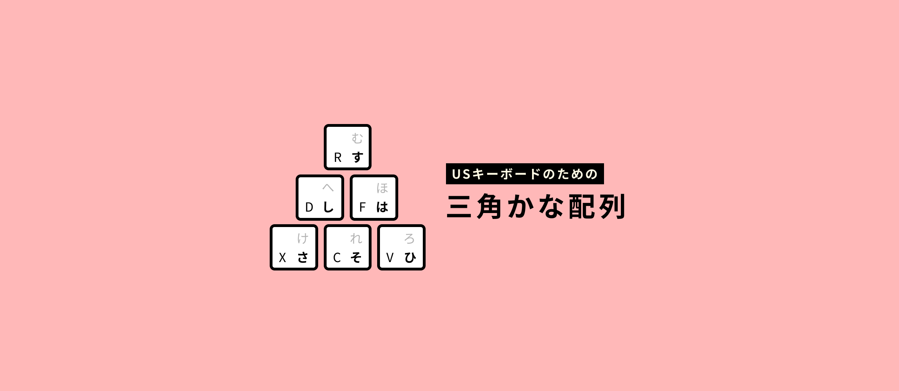
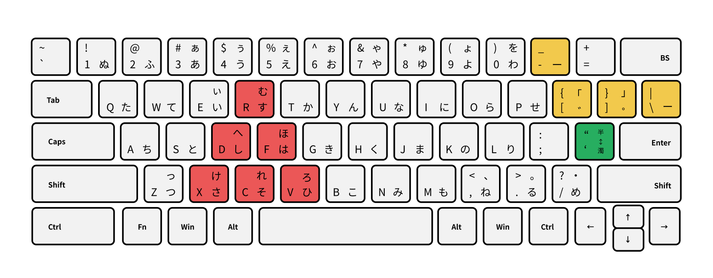
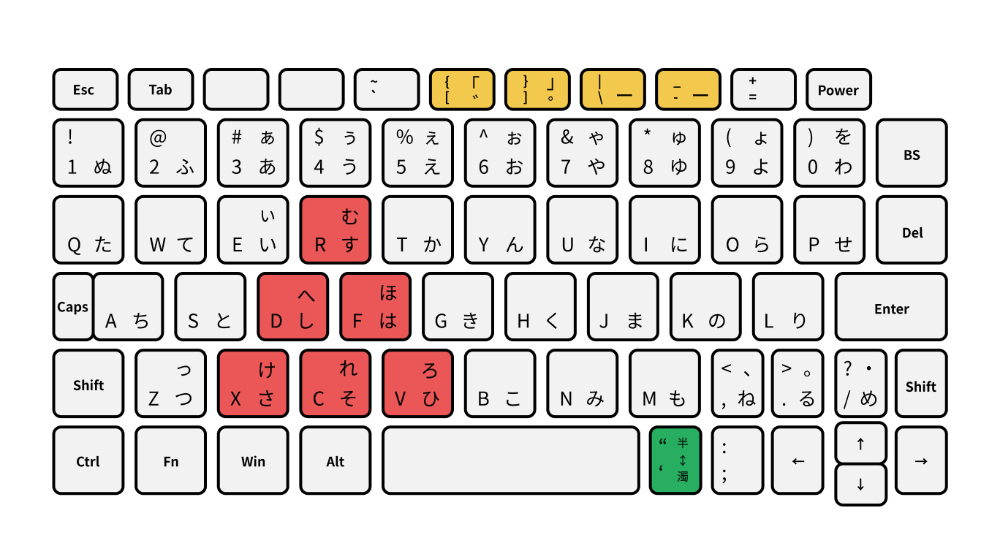

# さんかくカナ配列 for USキーボード

USキーボードに合わせて、JIS配列から記号キーと一部のカナの位置を調整した、かな入力用配列です。Google日本語入力 (Google IME Japanese) で利用することができます。JISからの変更点が三角形(下図の赤いところ)になっているので「さんかくJIS」と呼んでいます。

- 配列データ - [romantable-sankaku-jis.txt](https://raw.githubusercontent.com/cognitom/kana/master/romantable-sankaku-jis.txt)
- キーマップ - [keymap-recommended.txt](https://raw.githubusercontent.com/cognitom/kana/master/keymap-recommended.txt)

配列データをダウンロードして、IMEの設定画面からローマ字配列として読み込むと使えます。(カナ配列だけど)

キーマップの使用は任意ですが、<kbd>INSERT</kbd>にIMEのON/OFFを割り振り、<kbd>変換</kbd>などUS配列に存在しないキーを省いたものです。[Change Key](https://forest.watch.impress.co.jp/library/software/changekey/)などを使って、<kbd>Caps</kbd> と <kbd>Insert</kbd> を入れ替えておくとより便利です。

- 基本的な並びはJISかな配列 (JIS X 6002情報処理系けん盤配列)
- 一部のカナ(キーボードの右端のキー)を左手のシフト側に割り振り
  - <kbd>す</kbd> → <kbd>む</kbd> / <kbd>し</kbd> → <kbd>へ</kbd> / <kbd>は</kbd> → <kbd>ほ</kbd> / <kbd>さ</kbd> → <kbd>け</kbd> / <kbd>そ</kbd> → <kbd>れ</kbd> / <kbd>ひ</kbd> → <kbd>ろ</kbd>
  - 変更は三角形の範囲に限定し、文字形の似ているものに
  - 左手でシフトキーと合わせて押しやすい範囲
- カギ括弧と長音をUS配列で自然な位置に
  - 長音 `ー`: <kbd>-</kbd> (ハイフン)
  - 開始括弧 `「`: <kbd>{</kbd>
  - 終了括弧 `」`: <kbd>}</kbd>
  - 濁点・半濁点: <kbd>[</kbd> <kbd>]</kbd> ※JISと同じ位置
- <kbd>'</kbd>で濁点・半濁点・小文字のトグル
  - 例: <kbd>は</kbd> → <kbd>ば</kbd> → <kbd>ぱ</kbd> → <kbd>は</kbd> →
  - 例: <kbd>う</kbd> → <kbd>ぅ</kbd> → <kbd>ゔ</kbd> → <kbd>う</kbd> →

## 予備キー

小型キーボードなど、キーの物理的な配置によっては、上記のキーが使えない場合があります。そのため、配列としては冗長ですが、一部のキーについては予備キーを用意しています。

- 長音 `ー`: <kbd>\\</kbd>
- 開始括弧 `「`: <kbd>'</kbd> or <kbd>;</kbd> ※未確定の文字が前にあると使えません
- 終了括弧 `」`: <kbd>Shift</kbd> + <kbd>'</kbd> or <kbd>Shift</kbd> + <kbd>;</kbd>
- 濁点・半濁点・小文字トグル: <kbd>;</kbd>

## 小型キーボードでの使用例

小型キーボードでは、右端のキーは省略されたり、違う場所に追いやられたり変則的な配置になりがちです。「さんかくJIS」であればほとんどのキーボードで標準的な位置におさまります (記号を除く)。以下は、OneMix3のキーボードに適用した場合です。

## 参考

- [「はんそく」カナ配列](hansoku-jis.md)
- [新JIS用の配列](https://gist.github.com/ytomino/3610371) by ytomino
