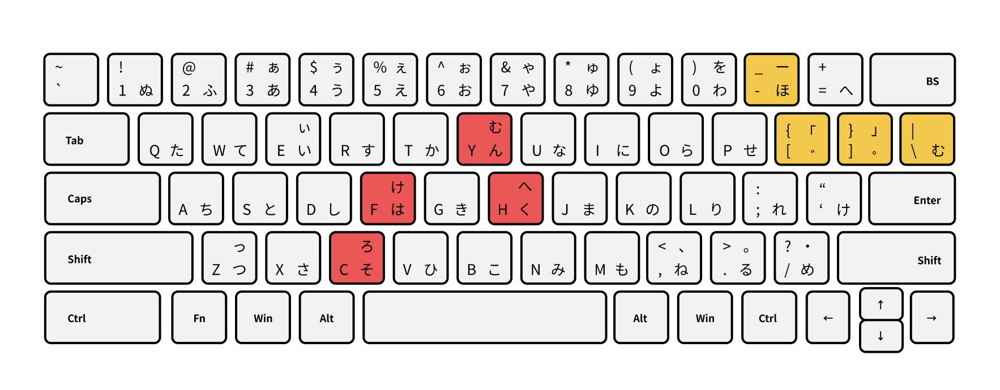

# 「はんそく」カナ配列

JIS配列から最低限の変更にとどめた配列です。特徴的なキーにちなんで「はんそく」カナ配列と呼んでいます。

- 配列データ - [romantable-hansoku-jis.txt](https://raw.githubusercontent.com/cognitom/sankaku/master/archived/romantable-hansoku-jis.txt)
- キーマップ - [keymap-recommended.txt](https://raw.githubusercontent.com/cognitom/sankaku/master/keymap-recommended.txt)

※この配列から、小型キーボードでの使い勝手を改良したのが「[三角かな配列](../README.md)」です。

配列データをダウンロードして、IMEの設定画面から読み込むと使えます。

キーマップの使用は任意ですが、<kbd>INSERT</kbd>にIMEのON/OFFを割り振り、<kbd>変換</kbd>などUS配列に存在しないキーを省いたものです。[Change Key](https://forest.watch.impress.co.jp/library/software/changekey/)などを使って、<kbd>Caps</kbd> と <kbd>Insert</kbd> を入れ替えておくとより便利です。
