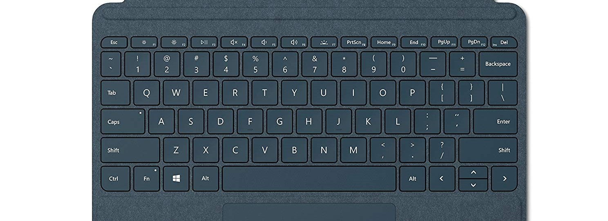
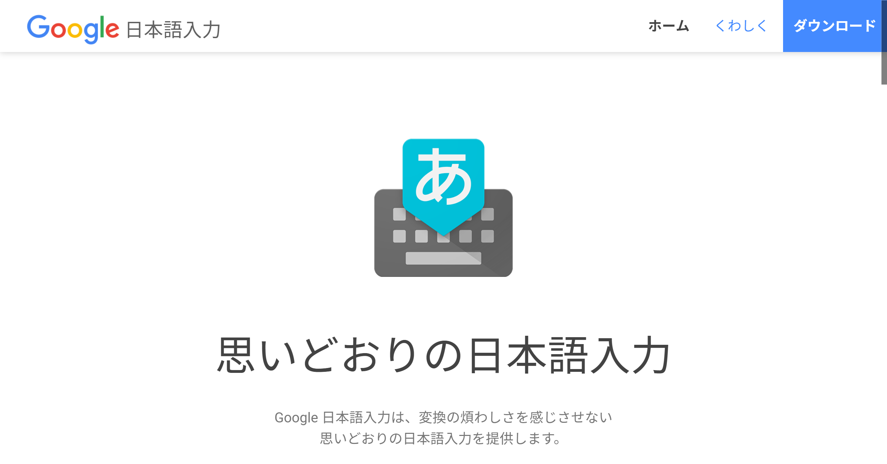

# 推奨セットアップ方法

## USキーボードを入手

- 一体型でも外付けでも構いません。上記に類する配列のキーボードが必要です。まれに小型のものでファンクションと数字の段を省略した4段のものも存在しますが、かな入力には適しません。5段、または6段のものを選んでください。
- カナ刻印はありませんが、割と指が覚えていますから大丈夫です。

## Google 日本語入力 (Google IME Japanese) のインストール

未導入であれば、ダウンロードしてきてインストールします。Windows版および、Mac版があります。

- [https://www.google.co.jp/ime/](https://www.google.co.jp/ime/)

※Linuxについては未検証ですが、[mozc](https://github.com/google/mozc)でも動くはずです。
※Android版については、ローマ字テーブルが固定となっているため、そのままでは導入できません。オープンソース版をカスタマイズしてコンパイルする必要がありそうです。

## Change Key のインストール

USキーボードは多言語での使用を想定していないため、言語や文字種の切り替えのためのキー(JISキーボードでいうところの半角全角キー)がありません。そこで、使われないキーの代表格の<kbd>Insert</kbd>をIMEのON/OFFに割り当てることにします(方法は後述)。

ただ、<kbd>Insert</kbd>はたいてい押しにくいところに追いやられています(上記写真のSurface Keyboardだと、<kbd>Fn</kbd><kbd>Del</kbd>)。そのままでは、使いにくいので、キーの位置を<kbd>Caps</kbd>と入れ替えます。

...執筆中
